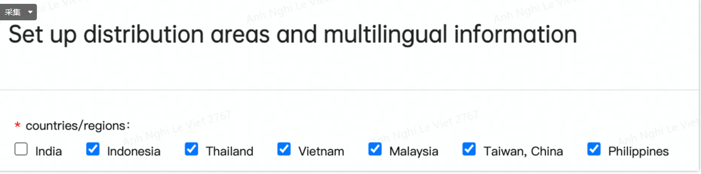

OPPO 推送说明
OPPO 海外推送支持全球（除西欧、北美），不要使用西欧和北美版的 OPPO 海外手机进行测试。
海外推送服务需应用上架，上架后可以支持多地区推送。
如果应用已经在国内接入且已经在软件商店上架，Engagelab 后台会判断推送目标的注册ID 是否是海外 ID，如果是海外 ID，将调用海外推送 API 进行推送。
如果应用没有在国内接入且进行上架，需要先在海外软件商店上架后才可以申请海外推送，目前海外软件商店仅支持以下区域上架应用。
